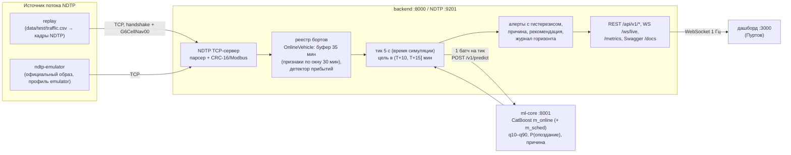

# Архитектура и надёжность (слайд П5)

## Схема: 4 контейнера, поток → прогноз → дашборд



- **Не монолит:** ML-ядро — отдельный сервис со своим API (`/v1/predict`, `/v1/model`), backend зовёт его одним батчем на тик.
- **Один код признаков** (`features/`) при обучении и на потоке: онлайн = офлайн с точностью 1e-6 (`tests/ml/test_online_parity.py`).
- **Горизонт по построению:** прогноз строится только для остановки с плановым временем в `(T+10, T+15]` мин; каждый прогноз пишется в журнал и сверяется с прибытием, которое увидел поток.
- **Настоящий NDTP:** replay и эмулятор идут одним путём — бинарные кадры по TCP; формат и CRC проверены на живом образе организаторов (20 реальных кадров в тестах).

## Надёжность: что происходит при сбоях

| Сбой | Поведение системы | Проверка |
|---|---|---|
| Обрыв потока NDTP (нет пакетов ≥ 15 с) | режим `DEGRADED`; прогноз по расписанию (`ml-core`, модель `m_sched`) с `quality=fallback`; сервис отвечает | `bash scripts/chaos.sh`: DEGRADED через 14.7 с после остановки источника (15.6 с от начала команды `stop`), `/health` 200 |
| Поток вернулся | первый пакет → `LIVE`; replay продолжает с текущего времени backend и досылает 30 мин «разгона» | LIVE через 1.8 с |
| Борт молчит > 30 с | `stale=true`, прогноз с `quality=degraded` | `tests/backend/test_degraded.py` |
| `ml-core` недоступен | circuit breaker: 3 ошибки → 30 с без вызовов → пробный вызов; прогноз по правилу с `quality=fallback` | chaos: правило через 0.2 с, `ml-core` снова через 31.3 с |
| Битый кадр, мусор в сокете | кадр отбрасывается, счётчик `ndtp_crc_errors_total`, соединение живёт; ресинхронизация по сигнатуре `0x7E7E` | `tests/backend/test_ndtp_codec.py` |
| Неизвестный терминал (`unitId` не из датасета) | борт на карте без прогноза, сервис не падает | живой эмулятор: 2 неизвестных юнита |
| Пакет новее «сейчас + 30 с» или старше 40 мин | отбрасывается (`dropped_total{kind="out_of_window"}`); допуск +30 с — на округление меток эмулятора и дрейф часов, признаки берут только `t ≤ T` | `test_future_and_ancient_packets_are_dropped` |
| Эмулятор перезапустился и потерял конфиг | сторожок раз в 10 с: пустой конфиг → `POST /api/config` заново | `tests/backend/test_emulator_ctl.py` |
| Медленный клиент WebSocket | очередь на 1 сообщение, старый снапшот вытесняется | `dropped_total{kind="ws_slow_client"}` |

## Демо обрыва потока (для видео)

```bash
docker compose up --build -d
bash scripts/chaos.sh
```

Скрипт печатает хронологию: исходный режим → `docker compose stop replay` → DEGRADED (секунды) → прогнозы с `quality=fallback` → `docker compose start replay` → LIVE → падение и возврат `ml-core`. На дашборде в это время меняется плашка режима.
